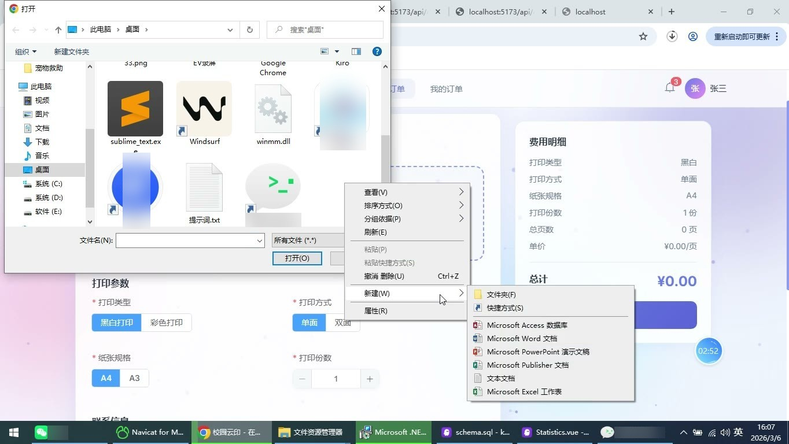
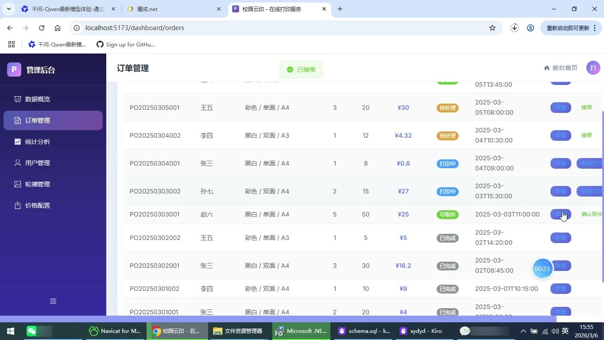
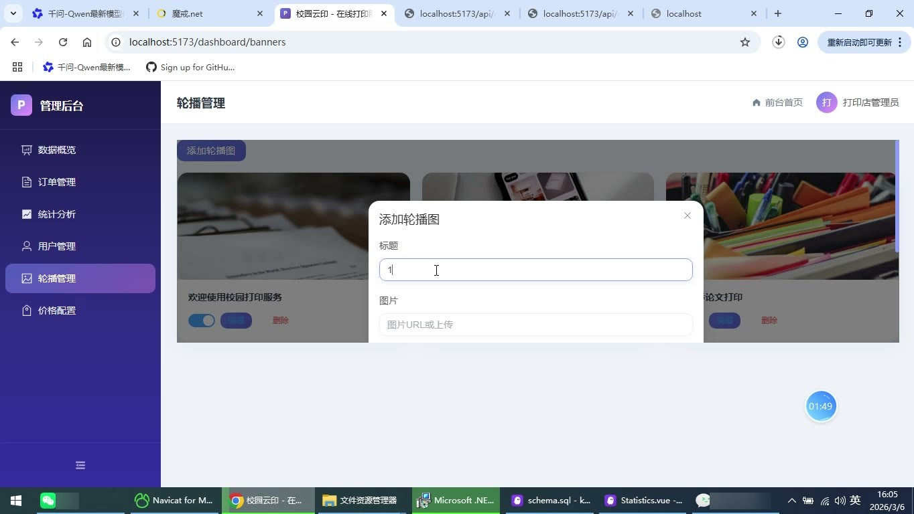

# (附文档)Springboot3+Vue3+MySQL 校园打印店在线下单与取件系统

**技术栈**：Springboot3、Vue3、MySQL

### 系统简介

本系统是一款面向校园场景的打印店在线下单与取件管理平台，采用前后端分离架构。系统包含普通用户端和管理员端两大角色，普通用户可在线提交打印订单、上传文件、查看订单进度与站内消息；管理员可进行订单全流程处理、用户管理、价格配置、轮播图维护及经营数据统计。系统内置完整的订单状态流转机制（待处理→打印中→可取件→已完成/已拒绝），并支持基于打印参数的价格自动计算。
 
### 核心功能
 
### 普通用户端

 
- 注册与登录：通过用户名、密码、真实姓名、手机号完成账号注册，注册后自动分配"STUDENT"角色，登录成功后返回JWT令牌及用户基本信息。 
- 账号安全：支持修改个人资料（真实姓名、手机号、头像），支持原密码校验后修改登录密码。 
- 提交打印订单：填写联系人姓名、联系电话，选择打印类型（黑白/彩色）、打印方式（单面/双面）、纸张尺寸、打印份数，填写备注信息。 
- 上传打印文件：支持上传单个或多个文件，单文件大小限制10MB，系统自动记录文件名、路径、大小、类型。 
- 自动价格计算：根据打印类型、纸张、单双面、份数及文件总页数自动计算订单总费用，价格规则由管理员后台配置。 
- 我的订单列表：分页查看个人订单列表，支持按订单状态（待处理/打印中/可取件/已完成/已拒绝）筛选，按提交时间倒序排列。 
- 订单详情查看：查看订单完整信息，包括订单编号、打印参数、联系人信息、费用明细、当前状态、拒绝原因。 
- 下载打印文件：在订单详情中可预览文件列表并下载已上传的原始文件。 
- 站内消息通知：接收订单状态变更通知（提交成功、已接单、已拒绝、可取件、已完成），支持标记单条已读或全部已读。 
- 未读消息提醒：顶部展示未读消息数量角标，点击进入消息中心查看通知详情。
 
### 管理员端

 
- 工作台数据总览：展示总订单数、今日订单数、今日营业额、待处理订单数，以卡片形式呈现核心经营指标。 
- 订单状态分布图表：以环形图展示各状态订单数量占比（待处理/打印中/可取件/已完成/已拒绝）。 
- 近7天订单趋势：折线图展示每日订单数量变化，柱状图展示每日营业额变化。 
- 订单管理列表：分页查看全部订单，支持按状态筛选，支持按订单编号、联系人姓名、联系电话模糊搜索。 
- 订单处理操作：对待处理订单执行"接单"操作（状态变为打印中）或"拒单"操作（填写拒绝原因）；对打印中订单执行"完成打印"（状态变为可取件）；对可取件订单执行"确认取件"（状态变为已完成）。 
- 订单详情查看：查看完整订单信息及关联文件列表，可下载订单中的打印文件。 
- 用户管理：分页查看注册用户列表，支持按用户名/姓名/手机号搜索，支持启用或禁用用户账号。 
- 价格配置管理：查看当前打印价格规则列表，修改黑白/彩色打印的单面价格及双面倍率。 
- 轮播图管理：查看全部轮播图列表，支持新增、编辑、删除轮播图，可设置标题、图片、排序值，支持上传本地图片，支持启用/停用轮播图。 
- 经营数据统计：按日期范围查询每日订单数与营业额，支持导出Excel报表（包含日期、订单数、营业额三列）。
 
### 技术栈

 后端框架Spring Boot 3.x ORM框架MyBatis-Plus（含分页插件、逻辑删除、自动填充） 权限认证JWT（拦截器校验Token，按角色控制访问） 前端框架Vue 3（Composition API + script setup） 状态管理Pinia（用户登录状态管理） 路由管理Vue Router 4（含路由守卫鉴权） UI组件库Element Plus 图表库ECharts 5 构建工具Vite 数据库MySQL 8.x Excel导出Apache POI（XSSFWorkbook） 文件上传Spring MultipartFile（本地磁盘存储）
 
### 交付内容

 
- 后端完整源码 
- 前端完整源码 
- 数据库初始化脚本 
- 万字文档

## 界面展示

---

## 获取完整源码 + 万字文档

本仓库为项目介绍页。**完整前后端源码、数据库初始化脚本、万字项目文档**，请加微信 `kangkangcode`，或访问 [codekk.top](http://codekk.top) 获取。

可作课程设计 / 毕业设计参考，支持远程部署调试。